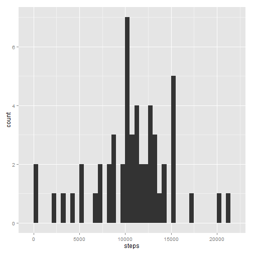
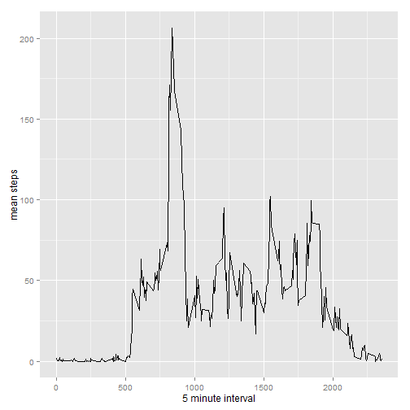

# Reproducible Research: Peer Assessment 1


## Loading and preprocessing the data


```r
data <- read.csv("activity.csv", stringsAsFactor=FALSE)
data <- transform(data, date=as.Date(date))
```


## What is mean total number of steps taken per day?


```r
#Plot
library("ggplot2")
obs1 <- aggregate(steps ~ date, data, sum)
qplot(x=steps, data=obs1, binwidth=500)
```

 

```r
#Calculation of the mean and median
options(digits=2, scipen=100)
obs1.med <- median(obs1$steps)
obs1.mea <- mean(obs1$steps)
```

**mean** total of steps taken each day : 10766.19  
**median** total of steps taken each day : 10765

## What is the average daily activity pattern?


```r
#subset data
obs2.l <- aggregate(steps~ interval, data, length)
obs2.s <- aggregate(steps~ interval, data, sum)
obs2.s$m <- obs2.s$steps/obs2.l$steps

#plot
qplot(x=interval, y=m, data=obs2.s, geom="line", xlab="5 minute interval", ylab="mean steps")
```

 

The **maximum** number of mean steps per interval is 206.17 

## Imputing missing values


```r
missing <- length(data$steps[is.na(data$steps)])
```

There is 2304 records with missing values in the dataset.

Let's replace the missing values by the mean of the number of steps for the interval


```r
#Creation of the new Dataset
data.nona <- data
data.nona$nona <- obs2.s$m
data.nona$steps[is.na(data.nona$steps)] <- data.nona$nona[is.na(data.nona$steps)]
data.nona$nona <- NULL

#subset data
obs3 <- aggregate(steps ~ date, data.nona, sum)
#plot
qplot(x=steps, data=obs3, binwidth=500)
```

 

```r
#Calculation of the mean and median
options(digits=2, scipen=100)
obs3.med <- median(obs3$steps)
obs3.mea <- mean(obs3$steps)
```

**mean** total of steps taken each day : 10766.19  
**median** total of steps taken each day : 10766.19

## Are there differences in activity patterns between weekdays and weekends?


```r
#create logical column with TRUE when weekend
data$wd <- as.POSIXlt(data$date)$wday %in% c(0,6)
#create text column with value "weekday"
data$day.type <-"weekday"
#change value to "weekend" depending on logical column
data$day.type[data$wd] <- "weekend"
#dropping logical column
data$wd <-NULL
#transform new character column into a factor column
data <- transform(data, day.type = as.factor(day.type))


#subset data
obs4.l <- aggregate(steps~ interval+ day.type, data, length)
obs4.s <- aggregate(steps~ interval+ day.type, data, sum)
obs4.s$m <- obs4.s$steps/obs4.l$steps

#plot
qplot(x=interval, y=m, data=obs4.s, geom="line", xlab="5 minute interval", ylab="mean steps", facets = day.type ~ .)
```

 
